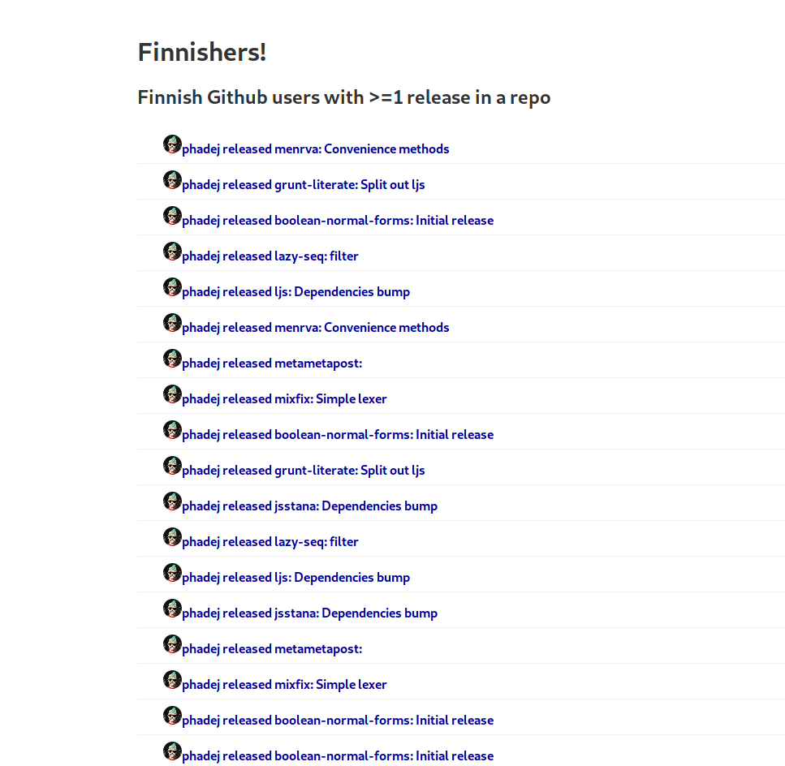

## Aiven Homework

* A Github Kafka Producer that finds Finnish users with Github repos containing >=1 releases.
* A Kafka Consumer that stores these findings in a Postgres DB
* An OpenAPI created by Postgrest
* A Web frontend to show these users in all their glory

#### Task

Utilise Aiven's offerings of Postgres and Kafka to produce data into a Kafka topic and consume into a Postgres database

---

### Solution

1. Producer - Retrieve Github users based in Finland with 1 or more releases in a repository
2. Consumer - Consume those repos and store them in a Postgres DB
3. API - Serve the data using Postgrest and use a view to collect all relevant data
4. Web - Show those users in a list and give them the props they deserve!

---

#### Running

There are four folders:

1. Producer -  This is a Python script that searches Github for Finnish users that have empty repositories and pushes to a Kafka topic
2. Consumer - This is a Python script that consumes those messages and stores them in a Postgres database
3. Web - This is a Svelte application (because I have not used it yet and wanted to try it) that provides a web site to view the data in a list
4. API - Postgrest service that connects to the Managed Aiven Postgres database and exposes an OpenAPI based on the db schema. There is also a script in there that was used to create the database, of no security importance

You will need to add your own keys to the `kafka_ssl` folder, or request to be added to the repository by the repository owner; they can then add your GPG key to `git-secret`.

----

### Resources/References

* Heavy help provided by the `kafka-python` and `pygithub` docs
* `Pony` ORM examples and `Svelte` Hacker News examples were also used

#### Tools

1. Postgrest was used for the API
2. Pony was used for the ORM in Python
3. Svelte was used for the web frontend
4. Git Secret was used to hide `env` and `config` files

## TODOS (Could Dos)

* [ ] Better exception handling for the producer and consumer
* [ ] Key/Value serializers
* [ ] Use Kafka Schema Registry
* [x] Fewer hard coded env vars
* [ ] Get more than one release for each user (rate limit affects this)
* [x] Check user exists before creating
* [ ] Thread producer/create system service
* [ ] Show user repos in json array with releases inside
* [ ] Containerise
* [ ] Use submodules instead of this monorepo
* [ ] As always...tests

---

### Screenshot

